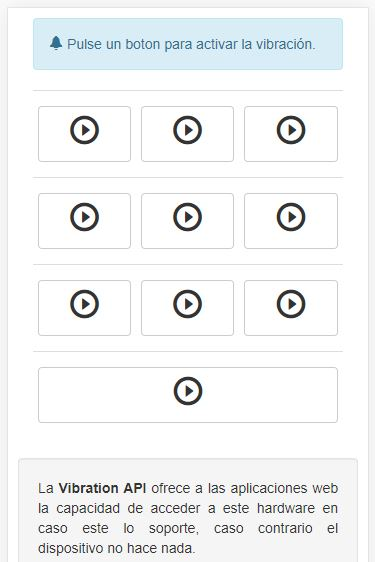

# Vibratest

Ejemplo de uso de la API de vibración de teléfonos móviles. Tenga en cuenta que si esta habilitado el modo silencio en el teléfono móvil, no se emitirá ninguna vibración.

**Vibration API**

> La Vibration API ofrece a las aplicaciones web la capacidad de acceder al hardware en caso de que sea soportado, en caso contrario el dispositivo no hace nada.
> 
> Puede consultar el soporte de **Vibration API** en los navegadores web más conocidos en [Can I use]("https://caniuse.com/#feat=vibration).

Demo: [Vibratest](https://marco.presting.pro/GitHub/Vibratest)

